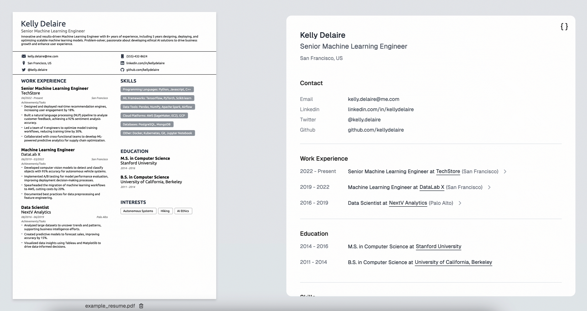
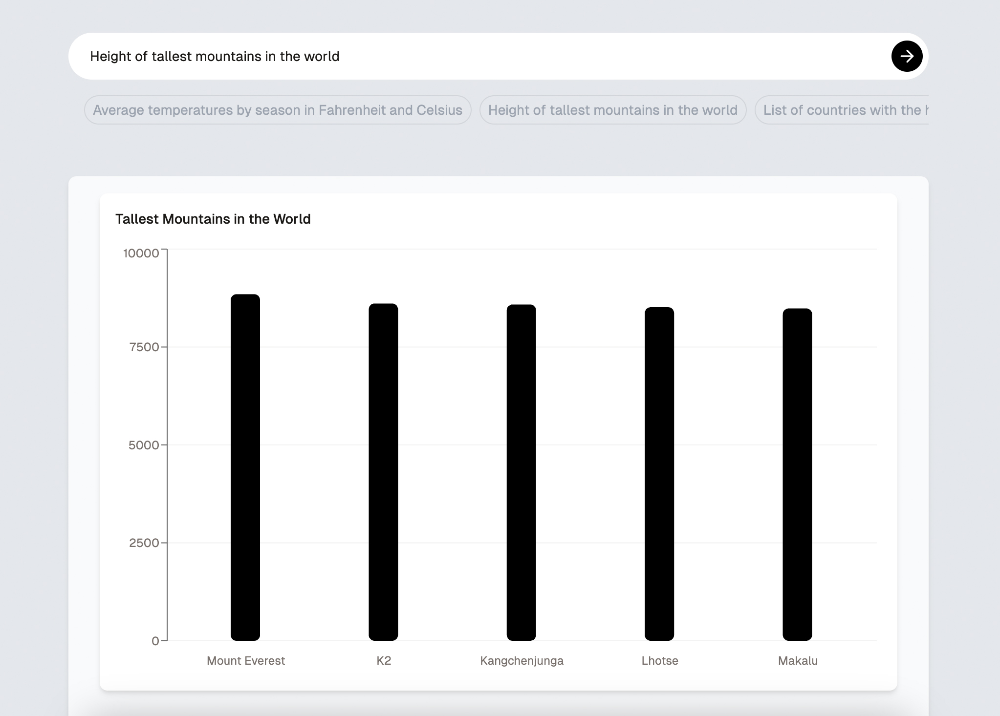

# Structured Outputs Sample Apps

[](LICENSE)


Structured Outputs is an OpenAI API feature that ensures responses and tool calls adhere to a defined JSON schema.
This makes building with our models more reliable, bridging the gap between unpredictable model outputs and deterministic workflows.

This repository contains a collection of sample apps showcasing the use of [Structured Outputs](https://platform.openai.com/docs/guides/structured-outputs).

Each app demonstrates practical ways to leverage this feature to build applications with NextJS.

---

## Table of Contents

1. [How to Use](#how-to-use)
2. [Sample Apps](#sample-apps)
3. [Resources](#resources)
4. [Contributing](#contributing)
5. [License](#license)

---

## How to use

1. **Set Up the OpenAI API:**

   - If you're new to the OpenAI API, [sign up for an account](https://platform.openai.com/signup).
   - Follow the [Quickstart](https://platform.openai.com/docs/quickstart) to retrieve your API key.

2. **Clone the Repository:**

   ```bash
   git clone https://github.com/openai/structured-outputs-samples.git
   ```

3. **Try a sample App:**

   - Navigate to the sample app you want to try (`cd /<app_folder>`)
   - Refer to the README of the app to run it locally.

4. **Make it your own**

   Explore the code, update it, and use it in your own projects or as a starting point!

## Sample Apps

There are three sample apps in this repository:

### [Resume Extraction](resume-extraction/README.md)

This app is a simple example of how to use Structured Outputs in model responses to display information in a structured format.



### [Generative UI](generative-ui/README.md)

This app focuses on generating UI components on the fly with Structured Outputs.



### [Conversational Assistant](conversational-assistant/README.md)

This app is a more complex example that combines multi-turn conversations, tool calling and generative UI.
You can use this as a starting point to build an assistant with reliable workflows.


## Resources

- To learn more about Structured Outputs, refer to the [Structured Outputs documentation](https://platform.openai.com/docs/guides/structured-outputs).

- To learn about Function Calling, refer to the [Function Calling documentation](https://platform.openai.com/docs/guides/function-calling).

- Try the [Introduction to Structured Outputs](https://cookbook.openai.com/examples/structured_outputs_intro) cookbook to get hands-on and run code snippets in Python.

## Contributing

You are welcome to open issues or submit PRs to improve this app, however, please note that we may not review all suggestions.

## License

This project is licensed under the MIT License. See the LICENSE file for details.
