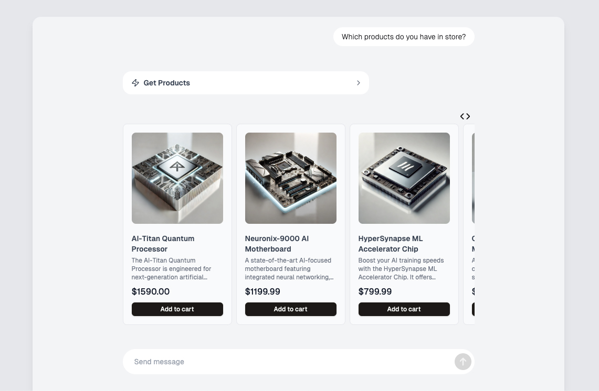

# Conversational Assistant Demo with Structured Outputs

## Overview

This repository contains a highly customizable demo app for a Structured Outputs assistant.

The assistant uses Structured Outputs with tools, making reliable workflows possible, including when there are multiple steps.

It also showcases how to do generative UI, using Structured Outputs to reliably generate components that will be rendered recursively.



## Features

- Multi-turn conversation handling
- Automatic tool execution
- Streaming responses and function calls
- Streaming generative UI

## How to run

1. Clone the repository:

   ```bash
   git clone https://github.com/openai/structured-outputs-samples.git
   cd conversational-assistant
   ```

2. Install dependencies:

   ```bash
   npm i
   ```

3. Set up your environment:

   ```bash
   export OPENAI_API_KEY=your-api-key
   ```

   Or create a `.env` file in the `resumer-extraction` folder containing:

   ```bash
   OPENAI_API_KEY=your-api-key
   ```

4. Run the demo

   ```bash
   npm run dev
   ```

   The app will be available at [`http://localhost:3000`](http://localhost:3000).

### Demo Flow

To try the demo, you can follow this flow.
/!\ Wait until the assistant is done replying before sending a new message.

1. Tell the assistant you would like to return an order (Ex: "Hi I'd like to return my order")

The assistant will call the `get_orders` tool to fetch the list of orders.

It will then display the list of orders in a carousel, and ask you which order you want to return.

2. Choose any order in the list by clicking on the "Select order" button

The assistant will then ask ask what the problem is to file a claim.

3. Tell the assistant that one of the order items is damaged (Ex: "The quantum processor is damaged")

At this point, the assistant will call the `file_claim` tool to file the claim and then create a return with the `create_return` tool before confirming the return has been created.

4. Ask the assistant which products are in store (Ex: "Which products do you have in store?")

The assistant will call the `get_products` tool to fetch the list of available products.

It will then display the list of products in a carousel, and ask you if you'd like more information.

5. Ask to see an overview of a numerical value (Ex: "Can you give me an overview of their weights?")

The assistant should display the answer in a bar chart.

6. Ask to compare other values (Ex: "Can you compare prices and dimensions?")

The assistant should display the answer in a table.

7. Ask for more details about a given product (Ex: "Can you tell me more about the CryoEngine cooling module?")

The assistant should display the answer in table.

8. Ask if you can add this item to your cart (Ex: "Can you add it to my cart?")

The assistant will call the `add_to_cart` tool to add the product to the cart and you will see a custom tool result component displayed.

## Customization

This demo app can be easily customized by modifying the files located in the `config` directory, as well as the API routes (you shouldn't need to update the `/turn_response` route).

Here are the customization options:

### Components

You can customize components and their parameters used by the `generate_ui` tool by updating the `components-definition.ts` file.

If you define new components, you should update `ui/components.tsx` to add React components that will be used to display generated components with the `generate_ui` tool.

If components allow for user interactions, you can add these actions to the conversation history by following the example in `user-actions.ts`.

### Tools

You can define the tools the assistant has access to by updating `tools-list.ts`. Make sure the tools have a valid schema.

You should also update `functions.ts` with a function matching each tool, which will be called when the tool call is triggered.

If you want to customize how a tool result is displayed, you can update `ui/tool-results.tsx`.

### Assistant

You can update the assistant's system prompt and the model used in `constants.ts`.

You can also customize in this file the initial message shown in the chat.

### Data

This app uses demo data, defined in `data/demo-data.ts`. The corresponding data types are defined in `data/types.ts`.

Feel free to remove these files to fetch the data from your own source.
