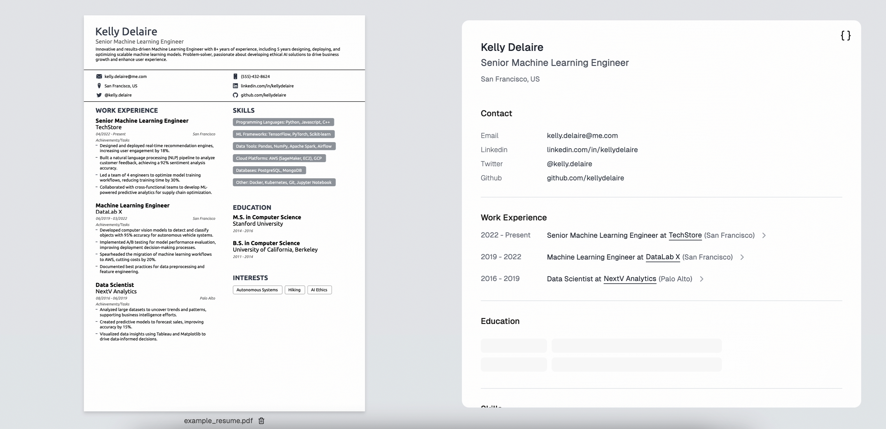
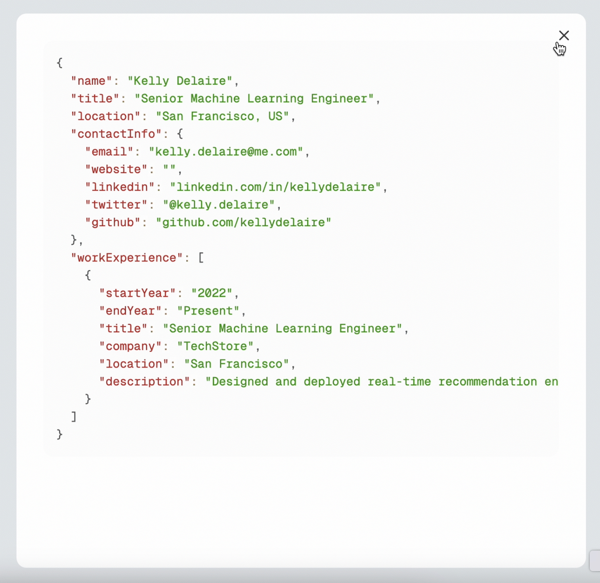

# Resume Extraction Demo with Structured Outputs

## Overview

This simple demo app showcases how to build deterministic interfaces by using Structured Outputs. It also demonstrates how to stream JSON responses.

As an example, the app extracts key details from PDF resumes.



## Features

- **Reliable Parsing:** Ensures output adheres to a defined JSON schema.
- **Streaming Responses:** Streams structured outputs for dynamic display in the UI.
- **Type-Safe Interfaces:** Simplifies downstream processing with predictable JSON responses.

## How to run

1. Clone the repository:

   ```bash
   git clone https://github.com/openai/structured-outputs-samples.git
   cd resume-extraction
   ```

2. Install dependencies:

   ```bash
   npm i
   ```

3. Set up your environment:

   ```bash
   export OPENAI_API_KEY=your-api-key
   ```

   Or create a `.env` file in the `resume-extraction` folder containing:

   ```bash
   OPENAI_API_KEY=<your-api-key>
   ```

4. Run the demo

   ```bash
   npm run dev
   ```

   The app will be available at [`http://localhost:3000`](http://localhost:3000).

## Usage

To test the app, you can either upload a PDF resume or use the [example resume](./public/example_resume.pdf) provided by clicking on the "Use the example" button.

You can then see the extracted fields stream in the UI. To see the full JSON response, toggle the JSON view by clicking on the "{}" icon in the top right.



To update the fields extracted by the model, you can edit the zod schema in `lib/resume.ts` file.
